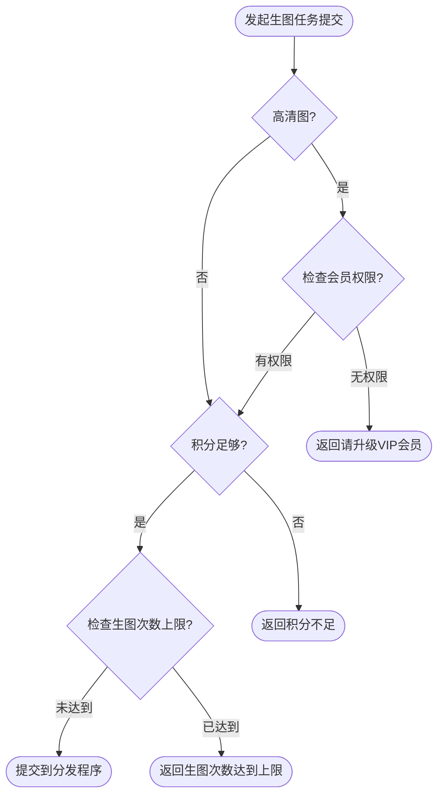

# Kucoll的个人博客

> An awesome project.

```mermaid
flowchart TD
A([发起生图任务提交])
A-->B{高清图?}
B--是-->C{检查会员权限?}
B--否-->D{积分足够?}
C--无权限-->E([返回请升级VIP会员])
C--有权限-->D
D--是-->F{检查生图次数上限?}
D--否-->G([返回积分不足])
F--未达到-->I([提交到分发程序])
F--已达到-->H([返回生图次数达到上限])
```

{docsify-updated}